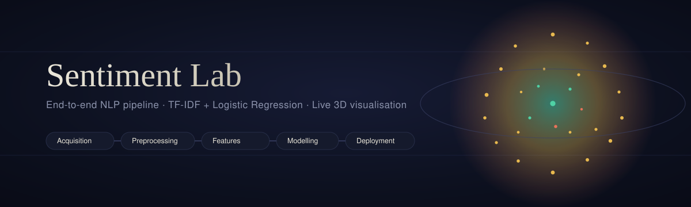
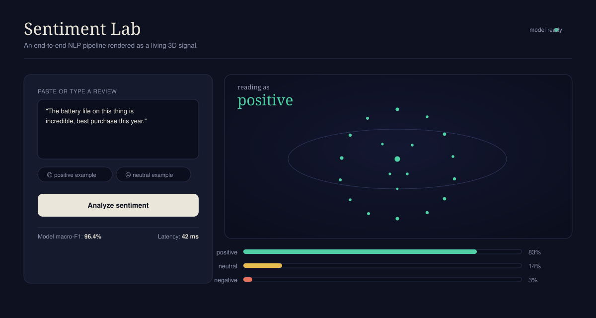
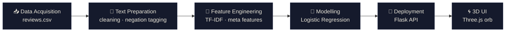

<div align="center">



<br/>


**A complete NLP pipeline — from raw reviews to a live 3D sentiment orb.**

[Overview](#-overview) · [Preview](#-preview) · [Quickstart](#-quickstart) · [Pipeline](#-the-pipeline) · [Deployment](#5%EF%B8%8F%E2%83%A3-deployment) · [3D UI](#-3d-ui-under-the-hood)

</div>

---

## 📖 Overview

**Sentiment Lab** classifies product reviews into `positive` / `neutral` / `negative`
using a TF-IDF + Logistic Regression pipeline, served through a Flask API and
visualised through a **Three.js 3D orb** that morphs colour, size, and
turbulence in real time based on the prediction.

<div align="center">

| | | | |
|:---:|:---:|:---:|:---:|
| 🎯 **Task** | 🧠 **Model** | 🌐 **Interface** | ⚡ **Setup** |
| 3-class sentiment | TF-IDF + LogReg | Flask API + 3D UI | < 2 min, offline |

</div>

---

## 🖼 Preview

<div align="center">


<sub>Left — text input & example chips · Right — live 3D orb + probability bars</sub>
</div>

<br/>

<div align="center">

| Orb colour | Meaning | Orb behaviour | Signal |
|:---:|:---|:---|:---|
| 🟢 Teal | Positive | Grows larger | Higher confidence |
| 🟡 Amber | Neutral | — | — |
| 🔴 Coral | Negative | Spikier / noisier | Higher uncertainty |

</div>

---

## 🚀 Quickstart

```bash
cd sentiment_nlp_app
pip install -r requirements.txt

# 1️⃣  Generate data + train the model
python src/train_model.py

# 2️⃣  Launch the API + 3D UI
python app.py
```

Open **`http://localhost:5000`** → type or paste a review (or click an example
chip) → hit **Analyze sentiment** → watch the orb react live.

---

## 📁 Project Structure

```
sentiment_nlp_app/
│
├── 🧠 app.py                      Flask API + 3D UI server
├── 📋 requirements.txt            Python dependencies
├── 📘 README.md                   You are here
│
├── 🎨 assets/
│   ├── banner.svg                 README hero banner
│   └── ui-preview.svg             App UI preview graphic
│
├── 📂 data/
│   └── reviews.csv                Generated labelled dataset          [Step 1]
│
├── 📂 models/                     Auto-created after training
│   ├── sentiment_clf.joblib       Trained Logistic Regression model
│   ├── feature_builder.joblib     Fitted TF-IDF + meta-feature transformer
│   └── metrics.json               Intrinsic evaluation results
│
├── 📂 src/
│   ├── data_acquisition.py        Step 1 — Data Acquisition
│   ├── preprocessing.py           Step 2 — Cleaning + Preprocessing
│   ├── feature_engineering.py     Step 3 — TF-IDF + meta features
│   ├── train_model.py             Step 4 — Training + evaluation
│   └── predict.py                 Inference helper used by the API
│
└── 📂 static/
    └── index.html                 Step 5 — 3D UI (Three.js, single file)
```

---

## 🔄 The Pipeline



> Mermaid diagrams render automatically on GitHub. If your viewer doesn't
> support Mermaid, the flow above simply reads left → right through the
> six numbered sections below.

---

## 1️⃣ Data Acquisition

> `src/data_acquisition.py`

In production, this data would come from:

- 🗄️ Internal review / order database
- 📊 Public datasets (Amazon / Flipkart reviews on Kaggle)
- 🕸️ Compliant web scraping
- 🔌 Third-party APIs (Play Store / App Store reviews)
- 👥 Human annotation / crowdsourcing

For this demo, the module **generates** a templated, noise-injected
(typos, emojis, casing, varied length) 3-class dataset so the entire
pipeline runs **offline and reproducibly**. Swap this module for a real
DB query / API call / scraper — every downstream step only depends on the
CSV schema: `review_id, text, rating, sentiment`.

---

## 2️⃣ Text Preparation

> `src/preprocessing.py`

**🧹 Cleaning**
- Lowercasing, HTML/URL stripping
- Emoji → word mapping (kept as *signal*, not discarded)
- Punctuation normalisation, whitespace cleanup, typo repair

**🔤 Preprocessing**
- Tokenisation
- **Negation-aware** stopword removal — `not`, `no`, `never` are preserved
  and tag the following word (`not_good`), since naive stopword removal is
  a classic bug that silently flips sentiment polarity
- Lightweight suffix-stripping stemming

**❓ Is advanced preprocessing required?**

| Model type | Advanced preprocessing? |
|---|---|
| Classical ML (TF-IDF / BoW) | ✅ Yes — negation tagging & emoji handling meaningfully help |
| Transformer (BERT / DistilBERT) | ⚠️ Minimal — subword tokenizers work best on lightly-cleaned raw text (see `clean_for_transformer()`) |

---

## 3️⃣ Feature Engineering

> `src/feature_engineering.py`

- 📈 TF-IDF over unigrams + bigrams (captures phrases like `not_good`)
- 🧮 Hand-crafted meta features: review length, exclamation count,
  "shouting" (uppercase) ratio, positive/negative lexicon counts
- 🔗 Combined into one sparse matrix (`scipy.sparse.hstack`)

---

## 4️⃣ Modelling

> `src/train_model.py`

**Algorithm:** TF-IDF + meta features → **Logistic Regression**
(fast, interpretable, strong short-text baseline, class-weighted).
Natural next steps: LinearSVC / XGBoost on the same features, or a
fine-tuned DistilBERT given more real labelled data + GPU budget.

**📐 Intrinsic evaluation** *(printed every training run → `models/metrics.json`)*

| Metric | Reported as |
|---|---|
| Accuracy | Overall correctness |
| Macro Precision / Recall / F1 | Per-class + averaged (surfaced in UI) |
| Confusion Matrix | Class-by-class error breakdown |

> ⚠️ Since the demo dataset is templated/synthetic, accuracy is
> unrealistically high (~100%). Real, noisy review data will show genuine
> confusion — especially neutral vs. positive/negative.

**📊 Extrinsic evaluation** *(needs live product data)*

- CSAT / NPS shift
- Support-ticket deflection rate
- Moderation time saved
- Conversion / click-through uplift
- A/B test deltas vs. control

---

## 5️⃣ Deployment

> `app.py`

| Endpoint | Purpose |
|---|---|
| `GET /` | Serves the 3D UI |
| `POST /api/predict` | `{"text": "..."}` → label + probabilities |
| `GET /api/metrics` | Training-time intrinsic metrics |
| `GET /api/health` | Liveness probe |

**🏗️ Production path:** Dockerize → Gunicorn + Nginx → load balancer / API
gateway (or AWS SageMaker / GCP Vertex AI / Azure ML) → CI/CD for
build → test → deploy.

**📡 Monitoring**
- Prediction latency *(already logged per request)*
- Model & data drift vs. training distribution
- Error rates & exceptions
- User feedback loop (👍/👎 on predictions) feeding a re-labelling queue
- Dashboards (Grafana / Kibana)

**🔄 Update strategy**
- Periodic retraining on freshly labelled data
- Active learning on low-confidence predictions
- Shadow / canary deployment — challenger vs. champion before promotion
- Versioned artifacts (MLflow / DVC) for instant rollback

---

## 🌀 3D UI, under the hood

The orb is a **fibonacci-distributed point cloud** (`THREE.Points`),
animated per-frame with sine-noise displacement:

| Visual property | Driven by |
|---|---|
| 🎨 Colour | Predicted class (teal / amber / coral), smoothly interpolated |
| 📏 Scale | Confidence — more confident → bigger orb |
| 🌊 Turbulence | `1 − confidence` — more uncertain → spikier, noisier |

No build tooling required — everything lives in `static/index.html` and
loads Three.js from a CDN.

<div align="center">

---

*Built as a reference implementation for an end-to-end NLP assignment.*

</div>
